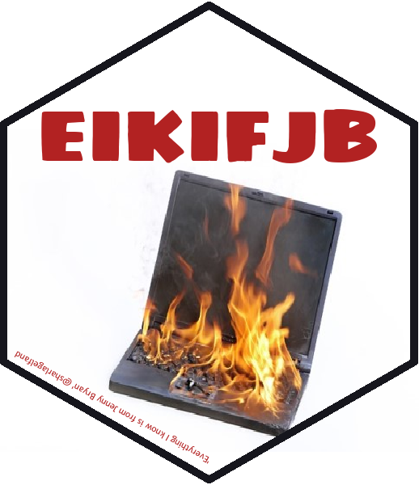

# EIKIFJB

"Everything I know is from Jenny Bryan"—Sharla Gelfand

- as spoken at [rstudio:conf 2020](https://sharla.party/talk/2020-01-01-rstudio-conf/)

Which then prompted this twitter exchange:

<blockquote class="twitter-tweet">
What about a hexagon enclosing &quot;EIKIFJB&quot; over a laptop aflame.
&mdash; Miles McBain (@MilesMcBain) <a href="https://twitter.com/MilesMcBain/status/1224441486369910786?ref_src=twsrc%5Etfw">February 3, 2020</a></blockquote>  

The Rmd file EIKIFJB.Rmd uses the [{hexSticker}](https://github.com/GuangchuangYu/hexSticker) package to generate a laptop on fire EIKIFJB sticker.

